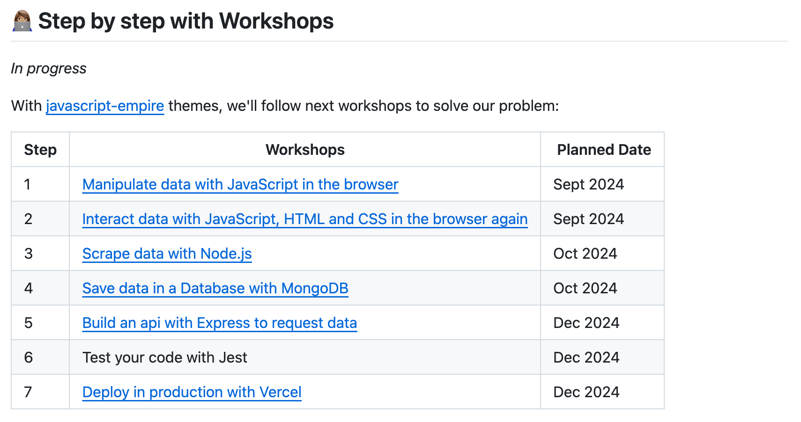

---

🧱 no rational

---

---

---

How to make some profits?

---

---

🤔 Really a good deal?

---

  <!-- .element height="50%" width="50%" -->

---

🤔 Really profitable?

---

---

Not sure

---

🤔 My Problem

---

📱 I cannot determine **easily on the same page** if a deal is really profitable.

---

Simple but time-consuming

---

😁 Help me with a fullstack Web Application

---

🎯 Build an web app to determine if a lego set deal is really a good deal.

---

Good Luck.

📅 See you end of December 2024.

---

🛣 How to solve it?

---

👖 Manipulate Deals, sold items ...

How to manipulate the products in the browser

---

🧹 Scrape Deals, sold items ...

How to fetch Products from different website sources

---

📱 Render Deals, sold items ... in the browser

How to interact with the Products in the browser

---

💽 Save Deals, sold items ... in database

How to avoid to scrape again and again the same data

---

⤵️ Request Deals, sold items ... with api

How to give access to your data

---

🐛 Test your code

How to ensure quality and confidence

---

🚀 Deploy in production

How to give access to anyone

---

🤔 What do you notice?

---

No code

---

---

---

👩🏽‍💻 Just tell me what to do

---

92bondstreet/lego

---

* Fork the project via `github`
* Clone the project
* Read the `README`

---

🎙 A.M.A

---

⚠️ 

Educational purpose
