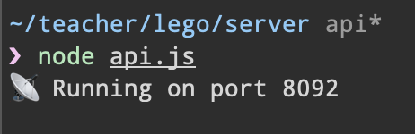
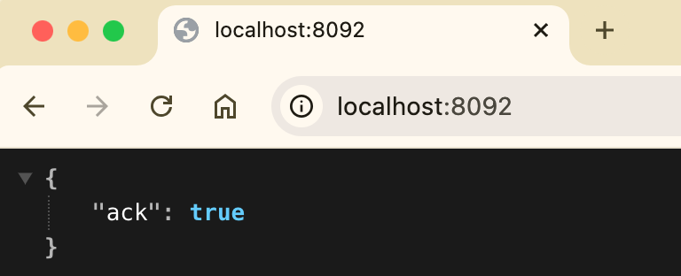
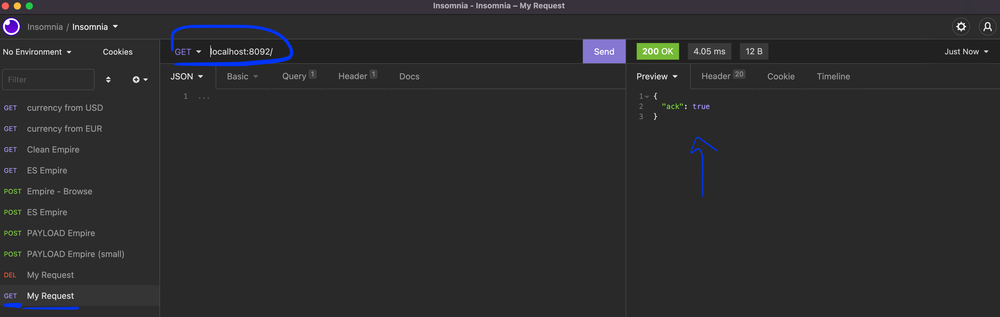

# ⤵️ Step 5 - Request the Deals and the Sales

> How to give access to your data

<!-- START doctoc generated TOC please keep comment here to allow auto update -->
<!-- DON'T EDIT THIS SECTION, INSTEAD RE-RUN doctoc TO UPDATE -->


- [🎯 Objective](#-objective)
- [🏗 Prerequisites](#%F0%9F%8F%97-prerequisites)
- [⤵️ List of endpoints to implement](#-list-of-endpoints-to-implement)
    - [`GET /deals/:id`](#get-dealsid)
    - [`GET /deals/search`](#get-dealssearch)
    - [`GET /sales/search`](#get-salessearch)
- [👩‍💻 Just tell me what to do](#%E2%80%8D-just-tell-me-what-to-do)
- [📦 Suggested node modules](#-suggested-node-modules)
- [🛣️ Related Theme and courses](#-related-theme-and-courses)

<!-- END doctoc generated TOC please keep comment here to allow auto update -->

## 🎯 Objective

**Build an api with Express to request data from your database...**

## 🏗 Prerequisites

1. Be sure **to have a clean working copy**.

This means that you should not have any uncommitted local changes.

```sh
❯ cd /path/to/workspace/lego
❯ git status
On branch master
Your branch is up to date with 'origin/master'.

nothing to commit, working tree clean
```

2. **Pull** the `master` branch to update your local with the new remote changes

```sh
❯ git remote add upstream git@github.com:92bondstreet/lego.git
## or ❯ git remote add upstream https://github.com/92bondstreet/lego
❯ git fetch upstream
❯ git pull upstream master
```

3. **Check the terminal output for the command `node api.js`**

```sh
❯ cd /path/to/workspace/lego/server
## install new dependencies
❯ npm install
## or ❯ yarn
❯ node api.js
```





## ⤵️ List of endpoints to implement

#### `GET /deals/:id`

Fetch a specific deal.

```sh
❯ curl -H "Accept: application/json" http://localhost:8092/deals/729134ef-e3a6-5f73-a4bb-8b6d552cccba
{
  "_id": "729134ef-e3a6-5f73-a4bb-8b6d552cccba",
  "link": "https://www.dealabs.com/bons-plans/lego-ideas-appareil-photo-polaroid-onestep-sx-70-21345-lego-2868572",
  "retail": 64.99,
  "price": 51.92,
  "discount": 20,
  "temperature": 64.58,
  "photo": "https://static-pepper.dealabs.com/threads/raw/NMPFD/2868572_1/re/300x300/qt/60/2868572_1.jpg",
  "comments": 0,
  "published": 1727282061,
  "title":"Jouet Lego Ideas Appareil Photo Polaroid OneStep SX-70 - 21345",
  "id": "21345",
  "community": "dealabs,
  ...
}
```

#### `GET /deals/search`

Search for specific deals

This endpoint accepts **at least** the following optional query string parameters:

- `limit` - number of deals to return (default: 12)
- `price` - filter by price (default: All price)
- `date` - filter by date (default: All date)
- `filterBy` - filter by specific values. Possible values:
 `best-discount`|`most-commented` ...
- ...

The results array should be sorted by price in ascending way.

```sh
❯ curl -H "Accept: application/json" http://localhost:8092/deals/search?limit=10&price=25&date=2024-11-01
{
  "limit": 10,
  "total": 5,
  "results": [
    {
      "link": "https://www.dealabs.com/bons-plans/lego-icons-le-chrysantheme-10368-lego-2928576",
      "retail": 27.99,
      "price": 19.59,
      "discount": 30,
      "temperature": 48.42,
      "photo": "https://static-pepper.dealabs.com/threads/raw/Hrdop/2928576_1/re/300x300/qt/60/2928576_1.jpg",
      "comments": 2,
      "published": 1732513597,
      "title": "Jeu de construction Lego Icons Le Chrysanthème 10368 (Via 8,40€ fidélités)",
      "id": '10368',
      "community": "dealabs",
      "uuid": "2689198f-4484-5ad8-a52e-85bb56ac0d0f"
    },
    {
      "link": "https://www.dealabs.com/bons-plans/lego-technic-le-batcycle-de-batman-42155-via-16eur-sur-la-carte-2928705",
      "retail": 39.99,
      "price": 23.99,
      "discount": 40,
      "temperature": 4.69,
      "photo": "https://static-pepper.dealabs.com/threads/raw/Vi8s4/2928705_1/re/300x300/qt/60/2928705_1.jpg",
      "comments": 1,
      "published": 1732520507,
      "title": "LEGO Technic Le Batcycle de Batman 42155 (via 16€ sur la carte)",
      "id": '42155',
      "community": "dealabs",
      "uuid": "46c7f4c9-3a96-589a-8b1b-fc572c205f0d"
    },
    {
      ...
    },
    {
      ...
    },
    {
      ...
    }
  ]
}
```

#### `GET /sales/search`

Search for specific sales

This endpoint accepts **at least** the following optional query string parameters:

- `limit` - number of sales to return (default: 12)
- `legoSetId` - filter by a specific lego set id
- ...

The results array should be sorted by date in descending way.

```sh
❯ curl -H "Accept: application/json" http://localhost:8092/deals/search?legoSetId=10300
{
  "limit": 12,
  "total": 12,
  "results": [
    {
      {
        "link": "https://www.vinted.fr/items/5100417162-lego-10300-delorean",
        "price": "147.7",
        "title": "Lego 10300 Delorean",
        "published": 1727185003,
        "uuid": "3f9a07c9-c963-57a6-9e3c-caf311fd5cbc"
      },
      {
        "link": "https://www.vinted.fr/items/4702008514-lego-10300-back-to-the-future",
        "price": "173.95",
        "title": "Lego 10300 Back to the future",
        "published": 1719679918,
        "uuid": "96533b2b-86bf-57e6-87f4-099f4e369728"
      },
      {
        "link": "https://www.vinted.fr/items/2327479404-tete-marty-retour-vers-le-futur-lego-10300",
        "price": "2.8",
        "title": "Tête Marty retour vers le futur Lego 10300",
        "published": 1666173008,
        "uuid": "d5735c41-990d-5fee-88e8-86b95aafe0d6"
      }
    {
      ...
    },
    {
      ...
    },
    {
      ...
    }
  ]
}
```


## 👩‍💻 Just tell me what to do

1. **Install the desktop API client to make easier your api development** [Insomnia](https://insomnia.rest)

2. **Check the API endpoint** [`/`](../server/api.js) with insomnia



3. **Implement the endpoints**

2. **Check the API request and response with insomnia**

4. **Commit your modification**

```sh
❯ cd /path/to/workspace/lego
❯ git add -A && git commit -m "feat(get-deal): get a specific deal"
```

([why following a commit message convention?](https://dev.to/chrissiemhrk/git-commit-message-5e21))

5. **Commit early, commit often**
6. Don't forget **to push before the end of the workshop**

```sh
❯ git push origin master
```

**Note**: if you catch an error about authentication, [add your ssh to your github profile](https://help.github.com/articles/connecting-to-github-with-ssh/).

If you need some helps on git commands, read [git - the simple guide](http://rogerdudler.github.io/git-guide/)

## 📦 Suggested node modules

- [dotenv](https://www.npmjs.com/package/dotenv) - Loads environment variables from .env for nodejs projects
- [express](https://www.npmjs.com/package/express) - Fast, unopinionated, minimalist web framework for node
- [nodemon](https://www.npmjs.com/package/nodemon) - Monitor for any changes in your node.js application and automatically restart the server - perfect for development

## 🛣️ Related Theme and courses

- 📡 [Theme 3 - About RESTful API](https://github.com/92bondstreet/javascript-empire/blob/master/themes/3.md#about-restful-api)
