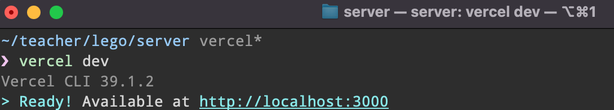
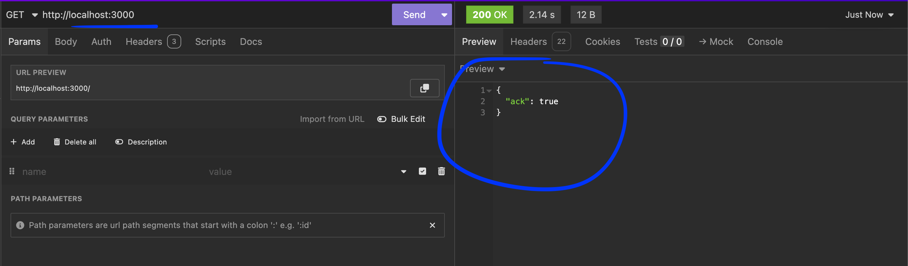
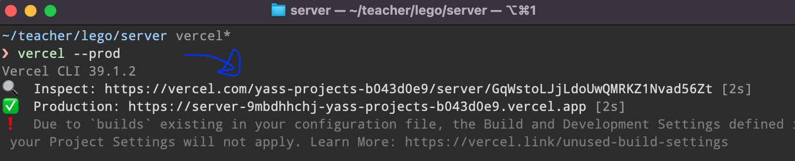
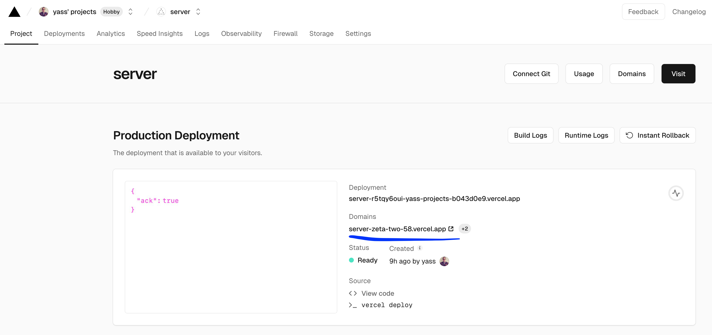
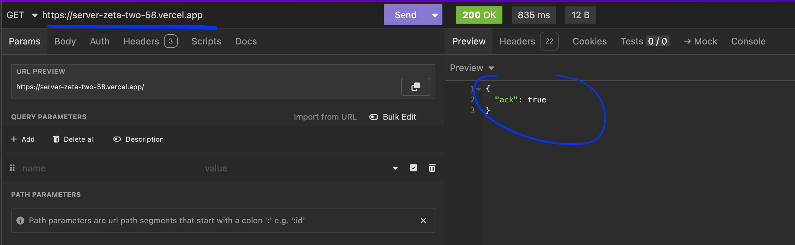

# 🚀 Step 7 - Deploy your Web application

> How to give access to anyone

<!-- START doctoc generated TOC please keep comment here to allow auto update -->
<!-- DON'T EDIT THIS SECTION, INSTEAD RE-RUN doctoc TO UPDATE -->
**Table of Contents**

- [🎯 Objective](#-objective)
- [🏗 Prerequisites](#%F0%9F%8F%97-prerequisites)
- [👩‍💻 Just tell me what to do](#%E2%80%8D-just-tell-me-what-to-do)
- [🚀 How to deploy with Vercel](#-how-to-deploy-with-vercel)
  - [The API](#the-api)
    - [1. Create a vercel.json file to configure the api deployment](#1-create-a-verceljson-file-to-configure-the-api-deployment)
    - [2. Test locally your api with the cli](#2-test-locally-your-api-with-the-cli)
    - [3. Deploy in production with the cli](#3-deploy-in-production-with-the-cli)
  - [The client](#the-client)
    - [1. Test locally your client with the cli](#1-test-locally-your-client-with-the-cli)
    - [2. Deploy in production with the cli](#2-deploy-in-production-with-the-cli)
- [📦 Suggested node modules](#-suggested-node-modules)
- [🛣️ Related Theme and courses](#-related-theme-and-courses)

<!-- END doctoc generated TOC please keep comment here to allow auto update -->


## 🎯 Objective

**Deploy your server and client application in Production with [Vercel](https://vercel.com/).**

## 🏗 Prerequisites

1. Be sure **to have a clean working copy**.

This means that you should not have any uncommitted local changes.

```sh
❯ cd /path/to/workspace/lego
❯ git status
On branch master
Your branch is up to date with 'origin/master'.

nothing to commit, working tree clean
```

2. **Pull** the `master` branch to update your local with the new remote changes

```sh
❯ git remote add upstream git@github.com:92bondstreet/lego.git
## or ❯ git remote add upstream https://github.com/92bondstreet/lego
❯ git fetch upstream
❯ git pull upstream master
```

## 👩‍💻 Just tell me what to do

1. **Create a free [Vercel](https://vercel.com) account** and install the command-line node interface. 

2. **Deploy your API** with Vercel

    For instance the [server/api.js](../server/api.js) is deployed to [https://server-zeta-two-58.vercel.app/](https://server-zeta-two-58.vercel.app/)

3. **Deploy your [client](../client/v2) application** with Vercel

    For instance the [client](../client/v2) is deployed to [https://v2-nine-livid.vercel.app](https://v2-nine-livid.vercel.app)

4. **Update your [client](../client/v2) codebase to fetch products from your deployed API**

    ```js
    const fetchDeals = async (page = 1, size = 6) => {
      try {
        const response = await fetch(
          `https://server-zeta-two-58.vercel.app?page=${page}&size=${size}`
        );
        const body = await response.json();

        ....
      } catch (error) {
        ...
      }
    };
    ```

    **You probably need to update your codebase.**


5. Deploy again... Then update again if needed ... and deploy. 

6.  **Commit your modification**

    ```sh
    ❯ cd /path/to/workspace/lego
    ❯ git add -A && git commit -m "feat(deploy): add vercel configuration"
    ```

    ([why following a commit message convention?](https://dev.to/chrissiemhrk/git-commit-message-5e21))

6. Complete the spreadsheet file with your API and client application url

7. **Commit early, commit often**
8. Don't forget **to push before the end of the workshop**

    ```sh
    ❯ git push origin master
    ```

    **Note**: if you catch an error about authentication, [add your ssh to your github profile](https://help.github.com/articles/connecting-to-github-with-ssh/).

    If you need some helps on git commands, read [git - the simple guide](http://rogerdudler.github.io/git-guide/)

## 🚀 How to deploy with Vercel

### The API

#### 1. Create a [vercel.json](../server/vercel.json) file to configure the api deployment

```json
{
  "version": 2,
  "builds": [{"src": "*.js", "use": "@vercel/node"}],
  "routes": [{"src": "/", "dest": "api.js"}]
}
```

#### 2. [Test locally](https://vercel.com/docs/cli/dev) your api with the cli

```sh
❯ cd /path/to/workspace/lego/server
❯ vercel dev
```




You could check your api with Insomnia.




#### 3. [Deploy in production](https://vercel.com/docs/cli/deploy#prod) with the cli

```sh
❯ cd /path/to/workspace/lego/server
❯ vercel --prod
```



Then get the production domain specified in your Vercel project dashboard.



You could check your deployment with Insomnia.




### The client

#### 1. Test locally your client with the cli

```sh
❯ cd /path/to/workspace/lego/client/dev
❯ vercel dev
```

#### 2. Deploy in production with the cli

```sh
❯ cd /path/to/workspace/lego/client/v2
❯ vercel --prod
```
Then get the production domain specified in your Vercel project dashboard.

More details with

* [Using Express.js with Vercel](https://vercel.com/guides/using-express-with-vercel)
* [Deploying to Vercel with Vercel CLI](https://vercel.com/docs/deployments/deploy-with-vercel-cli)
* [Different ways of configuring your Vercel projects and Vercel CLI](https://vercel.com/docs/configuration)


## 📦 Suggested node modules

- [vercel](https://www.npmjs.com/package/vercel) - The command-line interface for Vercel
- [paginate-info](https://www.npmjs.com/package/paginate-info) - A simple module to paginate your arrays and calculate limit and offset

## 🛣️ Related Theme and courses

* 📡 [Theme 3 - About Serverless](https://github.com/92bondstreet/javascript-empire/blob/master/themes/3.md#about-serverless)
